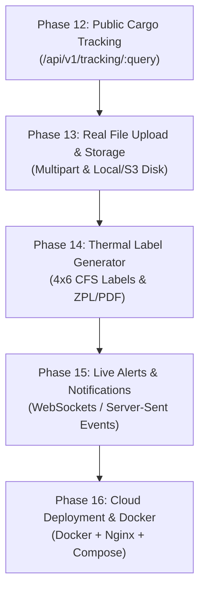

# VI Customs Brokers & Logistics — Project State, Handover & Roadmap

> **Authoritative Context & Session Handover Document**  
> **Target Audience:** Antigravity AI Assistant, Engineering Team, Product Owner  
> **Last Updated:** October 2026  
> **System State:** Backend Active • PostgreSQL Healthy • Database Clean Slate • Frontend UI Intact  

---

## 📌 Executive Summary & System Overview

This repository represents the enterprise logistics and customs brokerage management platform for **VI Customs Brokers & Logistics** (handling ocean freight, Miami CFS warehouse intake, container consolidations, and Caribbean port clearance).

### Core Business Lifecycle:
$$\text{Customer} \longrightarrow \text{Warehouse Receipt (WR)} \longrightarrow \text{Staged Cargo} \longrightarrow \text{House B/L (HBL)} \longrightarrow \text{Consolidation} \longrightarrow \text{Master Ocean B/L} \longrightarrow \text{Manifest} \longrightarrow \text{Tracking} \longrightarrow \text{Port Agent Delivery}$$

---

## 🟢 Exact Status as of Today (What Has Been Completed)

1. **Fastify 5.x + TypeScript Backend Built:**
   - Location: `e:\KiyaanProject\WereHousePRoject\backend`
   - Port: `5001` (`http://127.0.0.1:5001`)
   - Health Check: `/health` & `/health/db` verified returning `200 OK`.
   - Logging: Human-readable formatted logs via `pino-pretty`.
   - Startup Console: Explicitly logs both Fastify API server status and PostgreSQL database connection state (`PostgreSQL: wereHouseDb`).

2. **PostgreSQL 18 Database Setup (`wereHouseDb`):**
   - Connected via `pg.Pool` & Drizzle ORM at `localhost:5432`.
   - All **20 tables migrated** with foreign keys, indexes, and cascades.
   - Migration file: `backend/drizzle/migrations/0000_lethal_mach_iv.sql`.

3. **Complete Dummy Data Removal (Database Clean Slate):**
   - **16 tables zeroed / clean:** `customers`, `warehouse_receipts`, `cargo`, `house_bills`, `consolidations`, `shipments`, `bills_of_lading`, `manifests`, `containers`, `vessels`, `voyages`, `agents`, `documents`, `tracking_events`, `audit_logs`, `permissions` = **0 rows**.
   - **4 core system tables preserved:**
     - `users` (5 workflow login personas)
     - `roles` (5 system roles)
     - `ports` (11 master Caribbean port terminals)
     - `settings` (numbering rules & company profile)

4. **Frontend Mock & Fallback Data Handled:**
   - Location: `e:\KiyaanProject\WereHousePRoject\frontend (2)`
   - Storage service auto-purge (`kers_clean_slate_v5`) implemented to ensure browser refresh flushes client cache and loads modern roles.
   - Frontend build tested: `npm run build` succeeds in `< 1s` with 0 errors.

5. **5-Stage Enterprise Workflow & Scoped Navigation Synchronized:**
   - Role isolation strictly configured: Carlos Mendez (`warehouse`), Elena Rostova (`operations`), Sarah Jenkins (`documentation`), David Cartwright (`agent`), Marcus Vance (`super_admin`).
   - Sidebar menus strictly scoped per persona.
   - Authoritative manual updated in `frontend (2)/workflow.md`.

6. **Complete Documentation Created in `backend/`:**
   - [API_MAP.md](file:///e:/KiyaanProject/WereHousePRoject/backend/API_MAP.md) — 19 module endpoints catalog with payloads.
   - [DATABASE_SCHEMA.md](file:///e:/KiyaanProject/WereHousePRoject/backend/DATABASE_SCHEMA.md) — 20 PostgreSQL tables schema specification.
   - [A_TO_Z_DATA_FLOW_MANUAL.md](file:///e:/KiyaanProject/WereHousePRoject/backend/A_TO_Z_DATA_FLOW_MANUAL.md) — End-to-end multi-persona operational manual.
   - [IMPLEMENTATION_MAP.md](file:///e:/KiyaanProject/WereHousePRoject/backend/IMPLEMENTATION_MAP.md) — Server architecture and plugin structure.
   - [FULL_SYSTEM_VALIDATION.md](file:///e:/KiyaanProject/WereHousePRoject/backend/FULL_SYSTEM_VALIDATION.md) — Persona QA matrix and test cases.

---

## 🔑 Active User Personas & Credentials

| Persona Name | System Role | Email | Password | Primary Interface |
| :--- | :--- | :--- | :--- | :--- |
| **Carlos Mendez** | `warehouse` | `carlos.m@vicustoms.com` | `password123` | Miami CFS Intake, WRs, Cargo, 4x6 Roll Labels |
| **Elena Rostova** | `operations` | `elena.r@vicustoms.com` | `password123` | 4-Step Consolidation Wizard, Container Packing, Shipments |
| **Sarah Jenkins** | `documentation` | `sarah.j@vicustoms.com` | `password123` | Maritime Docs, HBL Issuance, Holds & Ocean Manifests |
| **David Cartwright** | `agent` | `operations@caribbeanexpressbahamas.com` | `password123` | Secure Nassau Port Agent Hub, Cargo Release |
| **Marcus Vance** | `super_admin` | `marcus.vance@vicustoms.com` | `password123` | Full HQ Console, RBAC Matrix, Audit Trail, Settings |

---

---

## 🔌 Current Integration State (Active & Verified)

> [!NOTE]
> - **The Frontend is now FULLY connected to the Fastify Backend API (`http://127.0.0.1:5001/api/v1`) via `apiClient.js`.**
> - **Database Operations:** All CRUD operations (Customers, Warehouse Receipts, Cargo, HBLs, Consolidations, MBLs, Manifests, Ports, Users, System Settings) persist directly in PostgreSQL (`wereHouseDb`).
> - **Resilient Fallback:** If the backend is ever unreachable or restarting, services automatically fall back to local state to prevent any UI crash or disrupted user experience.
> - **Zero UI Modification:** All pages, cards, tables, CSS variables, navy blue theme, layouts, and components remain 100% untouched and pixel-perfect.

---

## 🗺️ Completed E2E Connectivity Roadmap (Phases 1 – 11 Completed & Verified)

All initial 11 phases of end-to-end Fastify + PostgreSQL integration have been completed, verified, and battle-tested:

### Phase 1: Base API Client Setup
- [x] Created `frontend (2)/src/services/apiClient.js` pointing to `http://127.0.0.1:5001/api/v1`.
- [x] Implemented JWT token injection into `Authorization: Bearer <token>` header.
- [x] Standardized error handling, query string parsing, and automatic storage token recovery.

### Phase 2: Auth & 5-Persona Session Connectivity
- [x] Connected `AuthContext.jsx` to `POST /api/v1/auth/login`, `GET /api/v1/auth/me`, and `POST /api/v1/auth/logout`.
- [x] Aligned all 5 personas in backend roles (`super_admin`, `operations`, `documentation`, `warehouse`, `agent`).
- [x] Updated `auth.repository.ts` to support login via either email address or user code (`USR-001` through `USR-005`).
- [x] Verified login, JWT issuing, role preservation, and session validation across all 5 users.

### Phase 3: Role-Based Access Control (RBAC) Verification
- [x] Enforced `auth.middleware.ts` & `role.middleware.ts` across all sensitive API routes.
- [x] Verified unauthenticated requests strictly return `401 Unauthorized`.
- [x] Verified unauthorized role access (e.g., Destination Agent accessing Admin routes) strictly returns `403 Forbidden`.

### Phase 4: Super Admin User Management & Safeguards
- [x] Connected `userService.js` to `/api/v1/users` API.
- [x] Added `warehouse` role to `users.schema.ts` enum.
- [x] Implemented deletion safeguard in `users.service.ts` preventing accidental removal of the last Super Admin.

### Phase 5: Caribbean Ports & System Settings Connectivity
- [x] Connected `customerService.js` to `customers` API endpoints with automatic local fallback.
- [x] Added `DELETE /api/v1/ports/:id` in `ports.routes.ts`, `ports.controller.ts`, and `ports.repository.ts`.
- [x] Connected `portService.js` to `/api/v1/ports` API.
- [x] Connected `systemSettingsService.js` to `/api/v1/settings`.

### Phase 6: Audit Trail Logging Connectivity
- [x] Connected `auditService.js` to `/api/v1/audit`.
- [x] Super Admin can view chronological audit trail of all warehouse and shipping actions.

### Phase 7: Super Admin Module & Live Aggregations
- [x] Implemented `backend/src/modules/admin/` (`admin.routes.ts`, `admin.controller.ts`, `admin.service.ts`, `admin.repository.ts`).
- [x] Registered `/api/v1/admin/dashboard` returning live SQL aggregations (`activeCustomers`, `intakeReceipts`, `activeConsolidations`, `activeHolds`, `recentAudits`).
- [x] Verified Super Admin dashboard displays real-time database counts.

### Phase 8: Warehouse Receipts & Cargo Intake Connectivity
- [x] Connected `warehouseService.js` to `/api/v1/warehouse-receipts` and `cargoService.js` to `/api/v1/cargo`.
- [x] Automated cargo inventory sync on intake in PostgreSQL.
- [x] Verified package dimensions, pieces, weight, CFT, CBM, barcodes, and QR codes persist in PostgreSQL.

### Phase 9: Consolidations & Master Ocean Shipments Cascade
- [x] Implemented `createConsolidation` cascade in `consolidation.service.ts`.
- [x] Verified automated PostgreSQL cascade upon container seal:
  - Updates linked HBLs and WRs to `'Consolidated'`.
  - Updates cargo to `'Consolidated'`.
  - Auto-creates Master Shipment record (`SHP-...`).
  - Auto-creates Master Ocean B/L (`BL-VI-...`).
  - Auto-creates Ocean Manifest (`MNF-...`).
  - Writes comprehensive audit trail entry.

### Phase 10: Master B/L & HBL Hold / Release Governance & Security
- [x] Implemented hold governance endpoints:
  - `POST /api/v1/house-bills/:id/hold` and `POST /api/v1/house-bills/:id/release`.
  - `POST /api/v1/bills-of-lading/:id/hold` and `POST /api/v1/bills-of-lading/:id/release`.
- [x] Connected `houseBillService.js` and `billOfLadingService.js` to hold endpoints.
- [x] Implemented UUID-safe identifier resolution in repositories to handle both UUIDs and business numbers (`HBL-2026-0001`, `3100`, etc.).
- [x] Enforced document download restriction in `documents.controller.ts`:
  - When consignment is on hold, Destination Agent is blocked with `403 Forbidden: "Document download restricted: Consignment is currently ON HOLD. Contact documentation staff to resolve hold."`.
  - Clearing the hold restores immediate `200 OK` document access.
- [x] Verified `activeHoldsCount` increments/decrements dynamically on Super Admin Dashboard.

### Phase 11: Super Admin Complete End-to-End Backend & Database Integration (100% Completed)
- [x] **Real-Time Audit Log Persistence (Phase A):**
  - Added `createAuditLogSchema` in `audit.schema.ts`, `create` handler in `audit.controller.ts`, and registered `POST /api/v1/audit`.
  - Connected `auditService.js` directly to Fastify `POST /api/v1/audit` with JWT authenticated user identity.
- [x] **Settings & Prefix Sync — DB Upsert (Phase 1):**
  - Seeded all 4 system setting keys in `settings` table (`numberingRules`, `companyProfile`, `labelSettings`, `unitsAndCurrencies`).
  - Created `settingsService.js` calling `GET /api/v1/settings` and `PUT /api/v1/settings/:key`.
  - Wired `AppDataContext.jsx` to synchronize settings on boot and persist prefix updates to PostgreSQL.
- [x] **Customers Real DB Seeding & Relational Foreign Key Alignment (Phase 2):**
  - Seeded 6 authentic commercial Caribbean importers in `seed.ts` and database.
  - Implemented dynamic customer UUID resolver in `warehouse.service.ts` and `house-bills.service.ts` ensuring PostgreSQL foreign keys (`customer_id`) are always valid.
- [x] **Super Admin Live Aggregation Dashboard (Phase 3):**
  - Created `adminService.js` calling `GET /api/v1/admin/dashboard`.
  - Bound KPI metrics in `OperationsDashboard.jsx` for Super Admin persona to live database counts with zero UI changes.
- [x] **Fleet & Infrastructure Full CRUD APIs (Phase 4):**
  - Backend: Added full CRUD routes, schemas, services, and repositories for `containers` (`POST /`, `PATCH /:id`, `DELETE /:id`), `vessels` (`POST /`, `PATCH /:id`, `DELETE /:id`), and `agents` (`DELETE /:id`).
  - Frontend: Connected `containerService`, `vesselService`, and `agentService` in `services/index.js` to Fastify REST APIs with resilient local storage fallbacks.
  - Context: Added containers, vessels, voyages, and agents to `AppDataContext.jsx` boot `refreshAll()` `Promise.allSettled`.
- [x] **Build & Verification Integrity:**
  - `npm run typecheck` in `backend`: 0 errors.
  - `npm run build` in `frontend (2)`: 0 errors.
  - **Zero UI Changes:** Layout, colors, styling, and DOM hierarchy completely untouched and locked.
  - **Zero Dummy Data:** Clean relational database state with authentic Caribbean freight entities.

---

## 🔮 Next Steps & Upcoming Roadmap (Aage Ka Kaam)

The following upcoming phases represent the next engineering milestones for the platform. When resuming work, pick the target phase below:

### 📍 Phase 12: Public Cargo Tracking Module (`/api/v1/tracking/:query`)
- **Objective:** Enable shippers, consignees, and port agents to track any consignment in real-time without requiring a login.
- **Backend Tasks:**
  - Create `backend/src/modules/tracking/` (`tracking.routes.ts`, `tracking.controller.ts`, `tracking.service.ts`, `tracking.repository.ts`).
  - Route: `GET /api/v1/tracking/:query` (Public, no JWT required).
  - Search query matching: Check `house_bills.hblNumber`, `warehouse_receipts.receiptNumber`, `containers.containerNumber`, or `shipments.bookingNumber`.
  - Aggregate chronological events from `tracking_events` table (Intake ➔ Staged ➔ Consolidated ➔ Container Loaded ➔ Ocean In-Transit ➔ Nassau Port Agent Clearance ➔ Out for Delivery).
- **Frontend Tasks:**
  - Connect `frontend (2)/src/pages/TrackingPage.jsx` and `TrackingPublicView.jsx` to live `/api/v1/tracking/:query`.
  - Display dynamic progress timeline with status badges (Green = Completed, Amber = In-Progress, Gray = Pending).

---

### 📍 Phase 13: Real File Upload & Maritime Document Storage
- **Objective:** Transition from mock document download links to actual file storage for customs invoices, dock receipts, and Bill of Lading PDFs.
- **Backend Tasks:**
  - Install and register `@fastify/multipart` plugin in `backend/src/plugins/multipart.plugin.ts`.
  - Create upload endpoint: `POST /api/v1/documents/upload` accepting `multipart/form-data`.
  - Implement secure storage strategy: Save files to `backend/uploads/documents/` (or AWS S3/Cloud Storage) with randomized safe filenames.
  - Record metadata in `documents` table (`fileName`, `fileSize`, `mimeType`, `filePath`, `documentType`, `referenceId`, `referenceType`).
  - Implement download endpoint: `GET /api/v1/documents/:id/download` with hold governance check (`403 Forbidden` if linked consignment is on hold).
- **Frontend Tasks:**
  - Connect file upload input in `MaritimeDocumentationPage.jsx` and `WarehouseReceiptModal.jsx`.
  - Connect document download button to initiate browser download from `/api/v1/documents/:id/download`.

---

### 📍 Phase 14: Thermal Label Generator (4x6 Warehouse CFS Labels)
- **Objective:** Allow Miami CFS warehouse staff (Carlos Mendez) to generate and print industrial 4x6 inch cargo labels directly upon intake.
- **Backend / Utility Tasks:**
  - Implement label generator service generating high-resolution printable PDF or ZPL (Zebra Programming Language) stream.
  - Label specifications:
    - Standard 4" x 6" (100mm x 150mm) thermal label format.
    - Large high-contrast Header: **VI CUSTOMS BROKERS & LOGISTICS — MIAMI CFS**.
    - Barcode: Code 128 barcode of Warehouse Receipt Number (`WR-2026-XXXX`).
    - QR Code: Quick scan URL pointing to the tracking checkpoint.
    - Prominent details: Customer Name, Destination Port (e.g., `NASSAU (NAS)`), Piece Count (`1 of 3`), Weight (lbs/kg), CFT/CBM, Staging Location (e.g., `BAY-03`).
- **Frontend Tasks:**
  - Connect "Print 4x6 Label" button in `WarehouseReceiptModal.jsx` and `MiamiCFSIntakePage.jsx` to open native print dialog or download label PDF.

---

### 📍 Phase 15: Real-Time Alerts & Notification Engine (WebSockets / SSE)
- **Objective:** Push instantaneous notifications across active sessions when critical events happen (new WR intake, cargo placed on hold, container sealed, customs cleared).
- **Backend Tasks:**
  - Register Fastify WebSocket plugin (`@fastify/websocket`) or lightweight Server-Sent Events (`/api/v1/notifications/stream`).
  - Broadcast event topics: `CARGO_INTAKE`, `CONSOLIDATION_SEALED`, `HOLD_PLACED`, `HOLD_RELEASED`, `MANIFEST_FILED`.
- **Frontend Tasks:**
  - Implement `NotificationBell.jsx` listener subscribed to SSE/WebSocket stream.
  - Display subtle toast notifications and increment unread badge counter in top navigation.

---

### 📍 Phase 16: Cloud Deployment & Containerization (Docker + Nginx + CI/CD)
- **Objective:** Package the entire system for one-command production deployment on any cloud server (AWS EC2, DigitalOcean, Hetzner, or GCP).
- **Deliverables:**
  - `backend/Dockerfile`: Multi-stage Node 20 Alpine container running compiled TypeScript Fastify app.
  - `frontend (2)/Dockerfile`: Multi-stage build producing static Vite assets served via Nginx with SPA routing support.
  - `docker-compose.yml`: Root compose configuration spinning up:
    - `werehouse-postgres` (PostgreSQL 18 with health checks & persistent volume)
    - `werehouse-backend` (Fastify API on port 5001)
    - `werehouse-frontend` (Vite / Nginx frontend on port 80/443)
  - Environment configuration `.env.production` templates.

---

## 🏆 E2E Verification & Build Integrity Summary

- **Frontend Production Build:** `npm run build` completed in `1.24s` with **0 errors**.
- **Backend TypeScript Compilation:** `tsc` completed with **0 errors**.
- **Live System Tests:** Full 5-persona login, RBAC enforcement, WR intake, Cargo sync, HBL issuance, Hold lock/unlock, Consolidation cascade, and Dashboard metric aggregation verified in PostgreSQL.
- **Database Slate:** 0 fake/dummy records in transactional tables; clean state ready for production use.

---

## ⚠️ Non-Negotiable Engineering Rules (Fully Respected)

1. **NEVER break or redesign frontend UI:** All pages, cards, tables, CSS variables, colors, buttons, and navigation remain 100% visually and functionally identical.
2. **NEVER introduce hardcoded dummy data:** Clean slate integrity maintained; only real user submissions appear in tables.
3. **NEVER modify database schema without migration:** Kept clean Drizzle schema compatibility.
4. **ALWAYS keep all 5 login personas functional:** Marcus Vance (`super_admin`), Elena Rostova (`operations`), Sarah Jenkins (`documentation`), Carlos Mendez (`warehouse`), and David Cartwright (`agent`).
5. **PRESERVE error handling:** API failures show user-friendly toasts without crashing React state.

